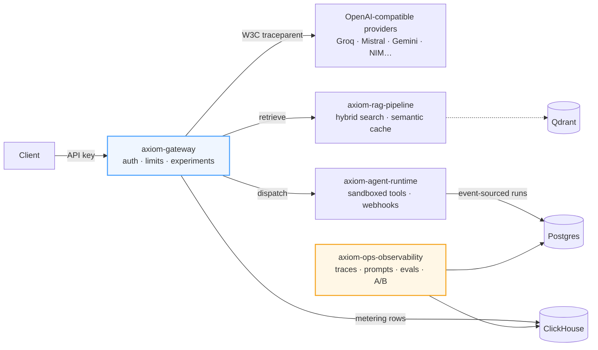

<div align="center">

# Axiom AI

[](LICENSE)
[](https://nodejs.org/)
[](https://www.python.org/)
[](docs/testing/TEST-EVIDENCE.md)
[](#observability)
[](#the-five-packages)

**The open-source infrastructure layer for running AI systems like production software, not demos.**

Axiom AI is five cooperating packages that together form a complete LLM platform:
a multi-provider gateway with metering and failover, a tenant-isolated RAG
knowledge fabric, a sandboxed agent compute engine, and an observability control
plane with evals, prompt versioning, and A/B experimentation — all bound by one
shared contract library.

```text
Nothing reaches a model without passing through the gateway.
Nothing enters memory without proving which tenant owns it.
No tool executes outside a resource-capped sandbox.
No claim about quality survives without an eval behind it.
Every request leaves a trace you can replay end to end.
```

[Quickstart](#quickstart) · [Architecture](#architecture) · [The Five Packages](#the-five-packages) · [Testing & Proof](#testing--proof-of-reality) · [Roadmap](#status--roadmap)

</div>

---

## Why Axiom AI Exists

Most AI stacks in the wild are islands: a hardcoded provider SDK here, an
ad-hoc prompt template there, API bills nobody can attribute, and no way to
answer "which prompt version produced this answer, at what cost, for which
tenant?" When a provider has an outage, the product goes down with it. When an
agent misbehaves, there is no event history to explain why.

Axiom AI treats those as **solved infrastructure problems**, not application
problems:

| Problem | Axiom's answer |
|---|---|
| Provider lock-in and outages | Weighted routing across ≥5 OpenAI-compatible providers, circuit breakers per upstream, deterministic failover chains |
| Unpredictable cost | Token-level metering into ClickHouse, per-tenant quotas, sliding-window rate limits with quota headers |
| Cross-tenant data leaks | Tenant scope derived from **verified credentials only** (never caller-supplied filters); red-team suite proves isolation |
| Untrusted agent code | isolated-vm tool sandbox with CPU-time + heap caps; escape suite (heap bombs, infinite loops, network egress, prototype pollution) fails closed |
| "Why did it say that?" | W3C trace-context propagated gateway → retrieval → agent → ops; one trace ID reconstructs the full journey in Jaeger/ClickHouse |
| Prompt drift | Prompts as immutable semver artifacts with environment promotion; eval regression gates block bad promotions |

## The Five Packages

During the build phase everything lives in this single workspace ([ADR
0007](docs/adr/0007-workspace-overlay-build-multi-repo-release.md)); each
directory becomes its own repository at release.

| Package | Published repo | What it does |
|---|---|---|
| [`packages/core-shared`](packages/core-shared) | `axiom-core-shared` | The contract library: Zod config schemas, error taxonomy, HMAC signing, telemetry SDK, protobuf defs. Every service consumes it; nothing speaks past it. |
| [`services/gateway`](services/gateway) | `axiom-gateway` | Fastify LLM proxy on **:3000**: SSE streaming with backpressure, input caching with provider-native prompt-cache metering, sliding-window rate limits, circuit-breaker failover, A/B experiment resolution |
| [`services/rag-pipeline`](services/rag-pipeline) | `axiom-rag-pipeline` | Python knowledge fabric on **:8000**: ingestion → chunking → embedding → hybrid dense+BM25 retrieval with two-tier semantic cache, strict tenant partitioning, recall@10 CI gate |
| [`services/agent-runtime`](services/agent-runtime) | `axiom-agent-runtime` | BullMQ compute engine on **:5000**: step-based orchestrator with event-sourced runs, isolated-vm tool sandbox, token-budgeted context assembly, HMAC webhooks with retry + DLQ replay |
| [`services/ops-observability`](services/ops-observability) | `axiom-ops-observability` | Control plane on **:4000**: OTel trace ingestion with Jaeger-compatible query API, Prisma-backed prompt registry with semver promotion, eval engine with golden datasets, A/B stats with win probabilities, Grafana dashboards + alert packs |

## Architecture

One request, four services, one trace:



Design principles that survive contact with production:

- **Contracts first.** Types, config validation, errors, crypto, and telemetry
  live in one published package. Protos are the source of truth; breaking
  changes are gated behind major versions.
- **Structural tenancy.** Tenant scope comes from verified credentials and is
  enforced by the data layer itself — a crafted filter cannot cross tenants
  because the filter is not the caller's to supply.
- **Fail-open only where safe.** The proxy path degrades gracefully when the
  control plane is down (experiments resolve to "no experiment"); the security
  path fails closed (sandbox escapes, forged webhooks, cross-tenant reads).
- **Everything observable from day one.** Tracing was not bolted on at the
  end — the trace-context bug story in our [test evidence log](docs/testing/TEST-EVIDENCE.md)
  shows why.

## Quickstart

Prerequisites: Node 20+, Python 3.11+, Docker with Compose v2, and at least one
provider key — Groq, Mistral, Google Gemini, SiliconFlow, or NVIDIA NIM all work
via their OpenAI-compatible endpoints (OpenAI/Anthropic adapters included,
key-gated).

```bash
git clone https://github.com/axiom-ai/axiom.git && cd axiom
make install          # TS workspaces + Python venv
cp .env.example .env  # add any provider key from D8 list
make up               # Redis · Postgres · ClickHouse · Qdrant · Traefik · all services
make smoke            # verify every health endpoint
```

You should see:

```text
ok  gateway /healthz              http://localhost:3000/healthz
ok  rag-pipeline /healthz         http://localhost:8000/healthz
...
All checks passed.
```

Then explore:

| Surface | URL |
|---|---|
| Gateway (proxy your first completion) | http://localhost:3000/v1/chat/completions |
| Jaeger UI (follow one trace ID) | http://localhost:16686 |
| Qdrant console | http://localhost:6333/dashboard |
| Grafana dashboards (`admin` / `axiom`) | http://localhost:3300 |

Your first proxied call:

```bash
curl -s http://localhost:3000/v1/chat/completions \
  -H "authorization: Bearer $AXIOM_API_KEY" \
  -H "content-type: application/json" \
  -d '{"model":"groq/openai/gpt-oss-120b","messages":[{"role":"user","content":"Say hi"}]}'
```

### Common commands

| Command | Purpose |
|---------|---------|
| `make build` / `make test` | Compile & test everything (vitest + pytest) |
| `make lint` / `make typecheck` | ESLint, ruff, mypy, tsc strict |
| `make logs` / `make ps` / `make down` | Compose operations |

## Observability

Every request emits Gen-AI semantic-convention spans (prompt/completion tokens,
model, cost, finish reason) into ClickHouse, queryable through a
Jaeger-compatible API. The ops plane adds:

- **Prompt registry** — prompts as immutable semver artifacts with
  dev→staging→prod promotion and diff views
- **Eval engine** — golden datasets scored against any prompt-version × model
  combination; a CI-callable CLI gates regressions before promotion
- **A/B experiments** — deterministic sticky traffic splits between arms
  (prompt versions or model overrides), reported once per key, summarized with
  95% confidence intervals and Bayesian win probabilities
- **Dashboards & alerting** — provisioned Grafana boards for latency
  percentiles, token spend by tenant/model, cache hit rates, queue depth, and
  eval pass rates, plus a Prometheus alert pack

## Testing & Proof of Reality

Claims are backed by suites, not vibes — the full evidence log lives in
[docs/testing/TEST-EVIDENCE.md](docs/testing/TEST-EVIDENCE.md). Highlights:

| Claim | Proof |
|---|---|
| Streaming works under chaos | SSE passthrough survives mid-stream upstream kills; three-provider failover proven E2E |
| Usage metering reconciles exactly | Recorded rows equal provider-reported token counts ±0% on fixture runs |
| Tenant isolation holds | 9-test red-team suite: forged HMACs, crafted filters, credential-derived scopes all fail closed |
| Sandbox escapes fail closed | CPU-time caps kill infinite loops, heap caps kill bombs, module/network/host-handle escapes blocked |
| Webhooks deliver exactly-once observation | At-least-once delivery deduped by signature/timestamp/event-id; DLQ replay restores delivery |
| One trace follows the whole journey | W3C traceparent asserted on outbound upstream calls, sharing the inbound trace id |

```bash
make build && make lint && make typecheck && make test   # the full gate
RUN_LIVE_CONTRACT_TESTS=1 npx vitest run --root services/gateway test/liveContracts.test.ts
```

## Status & Roadmap

Phases 0–4 are complete (foundation, gateway MVP + caching, agent runtime, RAG
pipeline, ops control plane) — see the live tracker with exit-criteria reviews
in [IMPLEMENTATION_PLAN.md](IMPLEMENTATION_PLAN.md).

- ✅ Shipped: provider failover, metering, tenant isolation, sandboxed agents, durable webhooks, tracing, evals, prompt registry, A/B experiments, dashboards
- 🔭 Phase 5: guardrails middleware (PII redaction), k6 load profiles, threat-model docs, docs site, Helm charts, v1.0.0 tags
- 🧭 Post-v1: Temporal evaluation, Pinecone adapter, native sparse indexes, Stripe GA

## Contributing

We welcome contributions of all sizes. Read [CONTRIBUTING.md](CONTRIBUTING.md),
sign off your commits (DCO), and check the `good first issue` label. Security
vulnerabilities follow [SECURITY.md](SECURITY.md); please do not open public
issues for them. Architectural decisions are recorded as ADRs in
[docs/adr](docs/adr) — propose significant changes via an RFC there first.

## License

[Apache-2.0](LICENSE)
