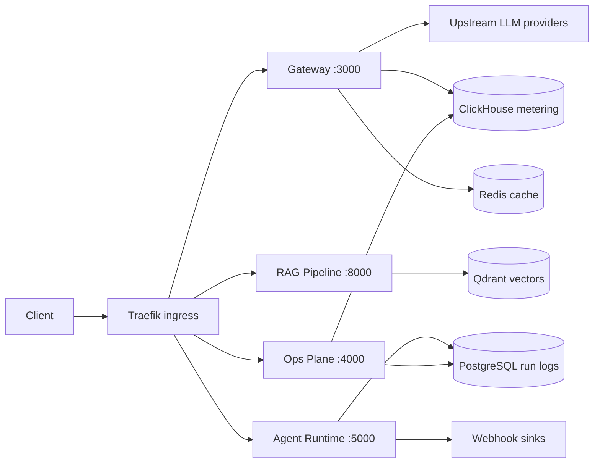

# Architecture

Axiom AI is four services plus a shared contract library, composed on an
internal network behind Traefik.

## Responsibilities

- **Gateway** owns provider access: streaming proxy, sliding-window rate
  limiting, circuit-breaker failover, two-tier input caching, token metering.
- **RAG pipeline** owns knowledge: parsing, chunking, embeddings, Qdrant
  hybrid retrieval (dense + BM25), semantic cache, PII guardrails.
- **Agent runtime** owns work: BullMQ step orchestration, isolated-vm sandbox,
  HMAC-signed webhooks with backoff and a dead-letter queue.
- **Ops plane** owns truth: trace queries, prompt registry with semver,
  eval engine, A/B experiments, and developer-mode billing.

`@tanvir1971/core` carries the Zod schemas, error taxonomy, HMAC signing,
telemetry SDK, metrics, and the secret-scrubbing logger every service shares.

Cross-service correlation uses W3C trace context: one `axiom.request.id`
follows a request from gateway to metering row.
