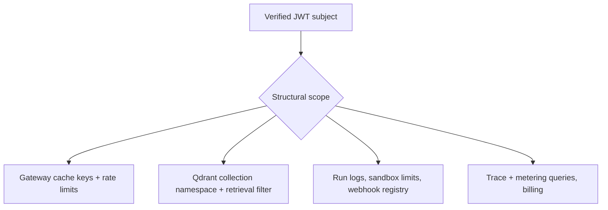

# Tenancy

Every request carries a tenant identity derived from a verified JWT. Services
never accept a tenant id from a request body.

Rules:

1. Tenant id is structural: derived from the JWT at the edge, propagated
   internally via `x-axiom-tenant` plus HMAC signature.
2. Isolation is enforced at the data layer, not by convention: Qdrant
   filters, SQL WHERE clauses, and cache-key components all include tenant.
3. The recall@10 CI regression gate includes cross-tenant isolation
   assertions so a filter omission fails the build.
